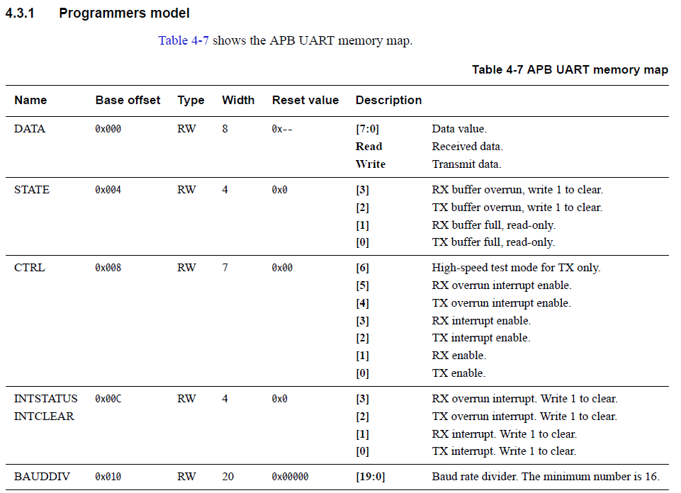

# Hardware Register Access Library Example: Cortex-M System Design Kit APB UART

The `hw_register_access_cmsdk_apb_uart_example` application within this repository provides an example of how the Hardware Register Access Library can be used to interface with hardware peripheral registers.  In this case, the hardware peripheral is a UART within the Cortex™-M System Design Kit Advanced Peripheral Bus, or CMSDK APB.

From page 4-9 of revision r1p0 of the *Cortex™-M System Design Kit Technical Reference Manual*:

This example application provides basic initialization of one of these UART peripherals, and provides a definition for an externally-declared function that presumably is used to "wire up" this UART to stdout.