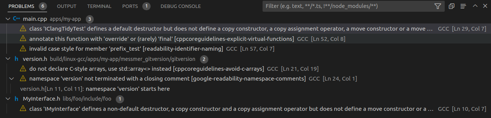

# Clang-Tidy as a Potential Alternative to PC-lint Plus

[Clang-Tidy documentation](https://clang.llvm.org/extra/clang-tidy/)

## Supported Checks

[Here](https://clang.llvm.org/extra/clang-tidy/checks/list.html) is the list of checks supported by Clang-Tidy.  For example, CPP Core Guidelines are supported as well as Google Guidelines.

## User Experience

When incorporated into the C++ Project Template as described [below](#how-to-incorporate), the user experience consists of navigable build warnings accessible via the VS Code Problems Pane.



## How to Incorporate

The following sections provide snippets of code that provide loose guidance for how to incorporate Clang-Tidy into the C++ Project Template.

### Install Into Docker Image

.../tools/docker/build-image/Dockerfile

```
#Install clang-tidy
RUN wget https://apt.llvm.org/llvm.sh && \
    chmod +x llvm.sh && \
    sudo apt-get install -y software-properties-common && \
    sudo ./llvm.sh 16 && \
    sudo apt-get install -y clang-tidy && \
    rm llvm.sh
```

### Incorporate Into CMake Configuration

.../tools/cmake/clang-tidy.cmake

```
find_program(CLANG_TIDY_EXE NAMES "clang-tidy")

set(CLANG_TIDY_CONFIG "--config-file=${CMAKE_SOURCE_DIR}/tools/clang-tidy/clang-tidy-checks.yml")
set(CLANG_TIDY_COMMAND "${CLANG_TIDY_EXE}" "-header-filter=." "${CLANG_TIDY_CONFIG}")
message(STATUS "Clang tidy command: ${CLANG_TIDY_COMMAND}")

macro(register_clang_tidy_target target)
    set_target_properties(
        ${target} 
        PROPERTIES 
        CXX_CLANG_TIDY 
        "${CLANG_TIDY_COMMAND}")
endmacro()
```

.../CMakeLists.txt

```
include(clang-tidy)
```

### Compiler Configuration

!!! warning
    Configuring clang-tidy for a non-clang compiler is still TBD.

### Define Checks

.../tools/clang-tidy/clang-tidy-checks.yml
```
Checks:          '-checks=-*,cppcoreguidelines-*,google-*,readability-identifier-naming*'

CheckOptions:
  - key:            cppcoreguidelines-explicit-virtual-functions.AllowSoleDefaultDtor
    value:          '1'
  - key:            modernize-use-override.IgnoreDestructors
    value:          '1'

#specify coding/naming conventions, a complete list of options can be found here:
#https://releases.llvm.org/8.0.0/tools/clang/tools/extra/docs/clang-tidy/checks/readability-identifier-naming.html
  - key:            readability-identifier-naming.MemberPrefix
    value:          m_
```

### Register Clang-Tidy Target(s)

.../apps/my_app/CMakeLists.txt

```
register_clang_tidy_target(my_app)
```
